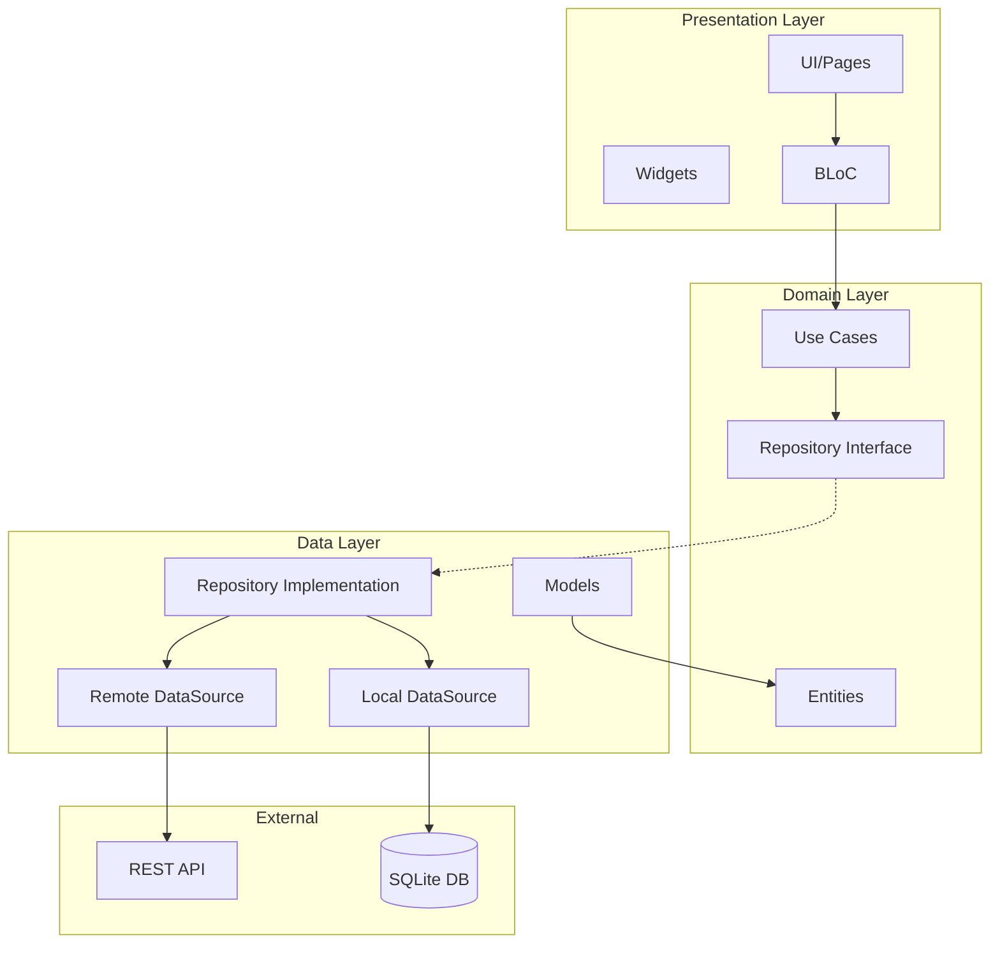
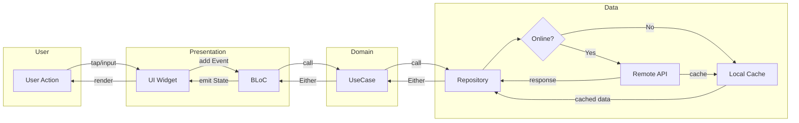
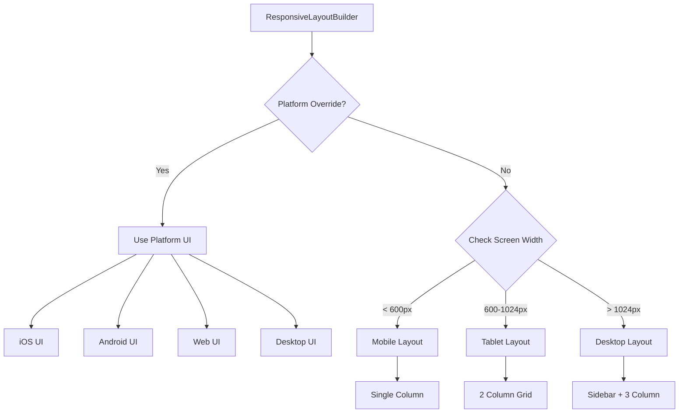
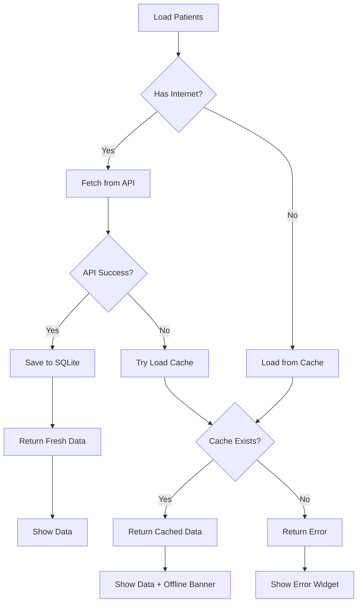
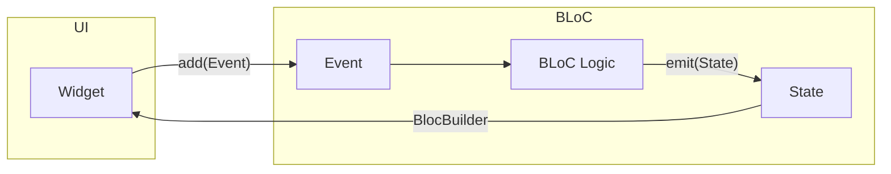
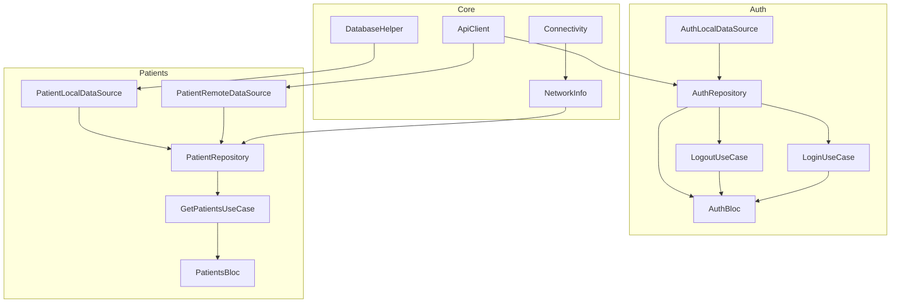

# ArchiTech - Project Documentation

## Project Structure

```
archi_tech/
├── lib/
│   ├── main.dart                                    # App Entry Point
│   │
│   ├── core/                                        # Shared/Core Functionality
│   │   │
│   │   ├── constants/                               # App-wide Constants
│   │   │   ├── app_colors.dart                      # Color definitions
│   │   │   ├── app_strings.dart                     # String constants
│   │   │   ├── app_dimensions.dart                  # Spacing, sizing, breakpoints
│   │   │   ├── app_assets.dart                      # Asset paths
│   │   │   ├── api_endpoints.dart                   # API URLs & endpoints
│   │   │   └── constants.dart                       # Barrel export
│   │   │
│   │   ├── database/                                # Local Storage
│   │   │   └── database_helper.dart                 # SQLite operations
│   │   │
│   │   ├── di/                                      # Dependency Injection
│   │   │   └── injection.dart                       # GetIt configuration
│   │   │
│   │   ├── error/                                   # Error Handling
│   │   │   ├── exceptions.dart                      # Custom exceptions
│   │   │   └── failures.dart                        # Failure classes (Either)
│   │   │
│   │   ├── navigation/                              # Navigation
│   │   │   └── app_router.dart                      # GoRouter configuration
│   │   │
│   │   ├── network/                                 # Network Layer
│   │   │   ├── api_client.dart                      # Dio HTTP client
│   │   │   └── network_info.dart                    # Connectivity checker
│   │   │
│   │   ├── usecases/                                # Base Classes
│   │   │   └── usecase.dart                         # UseCase abstract class
│   │   │
│   │   ├── utils/                                   # Utilities
│   │   │   ├── platform_utils.dart                  # Platform detection
│   │   │   └── responsive_utils.dart                # Responsive helpers
│   │   │
│   │   └── widgets/                                 # Reusable Widgets
│   │       ├── spacing_widgets.dart                 # VerticalSpace, HorizontalSpace
│   │       ├── button_widgets.dart                  # PrimaryButton, SecondaryButton
│   │       ├── input_widgets.dart                   # AppTextField, PasswordTextField
│   │       ├── card_widgets.dart                    # AppCard, InfoCard
│   │       ├── loading_error_widgets.dart           # Loading, Error, Empty states
│   │       ├── responsive_layout_builder.dart       # Responsive/Platform UI
│   │       └── widgets.dart                         # Barrel export
│   │
│   └── features/                                    # Feature Modules
│       │
│       ├── auth/                                    # Authentication Feature
│       │   ├── data/
│       │   │   ├── datasources/
│       │   │   │   └── auth_local_datasource.dart   # Local auth storage
│       │   │   ├── models/
│       │   │   │   └── user_model.dart              # User data model
│       │   │   └── repositories/
│       │   │       └── auth_repository_impl.dart    # Auth repo implementation
│       │   ├── domain/
│       │   │   ├── entities/
│       │   │   │   └── user.dart                    # User entity
│       │   │   ├── repositories/
│       │   │   │   └── auth_repository.dart         # Auth repo interface
│       │   │   └── usecases/
│       │   │       ├── login_usecase.dart           # Login use case
│       │   │       └── logout_usecase.dart          # Logout use case
│       │   └── presentation/
│       │       ├── bloc/
│       │       │   ├── auth_bloc.dart               # Auth BLoC
│       │       │   ├── auth_event.dart              # Auth events
│       │       │   └── auth_state.dart              # Auth states
│       │       ├── pages/
│       │       │   └── login_page.dart              # Login screen
│       │       └── widgets/
│       │           └── login_form.dart              # Login form widget
│       │
│       └── patients/                                # Patients Feature
│           ├── data/
│           │   ├── datasources/
│           │   │   ├── patient_local_datasource.dart    # SQLite cache
│           │   │   └── patient_remote_datasource.dart   # API calls
│           │   ├── models/
│           │   │   └── patient_model.dart           # Patient data model
│           │   └── repositories/
│           │       └── patient_repository_impl.dart # Patient repo (offline-first)
│           ├── domain/
│           │   ├── entities/
│           │   │   └── patient.dart                 # Patient entity
│           │   ├── repositories/
│           │   │   └── patient_repository.dart      # Patient repo interface
│           │   └── usecases/
│           │       └── get_patients_usecase.dart    # Get patients use case
│           └── presentation/
│               ├── bloc/
│               │   ├── patients_bloc.dart           # Patients BLoC
│               │   ├── patients_event.dart          # Patients events
│               │   └── patients_state.dart          # Patients states
│               ├── pages/
│               │   └── home_page.dart               # Home screen
│               └── widgets/
│                   └── patient_card.dart            # Patient card widget
│
├── pubspec.yaml                                     # Dependencies
├── analysis_options.yaml                            # Lint rules
└── README.md                                        # Project readme
```

---

## Component Overview

### Core Components

| File | Purpose |
|------|---------|
| `main.dart` | App entry, MaterialApp setup, BLoC providers |
| `injection.dart` | Registers all dependencies with GetIt |
| `app_router.dart` | Defines routes using GoRouter |
| `api_client.dart` | Dio client with interceptors |
| `database_helper.dart` | SQLite CRUD operations |
| `responsive_layout_builder.dart` | Screen size + Platform UI switching |

### Auth Feature

| Layer | File | Purpose |
|-------|------|---------|
| Entity | `user.dart` | User business object |
| Repository | `auth_repository.dart` | Interface for auth operations |
| UseCase | `login_usecase.dart` | Executes login logic |
| BLoC | `auth_bloc.dart` | Manages auth state |
| UI | `login_page.dart` | Login screen with platform-specific UI |

### Patients Feature

| Layer | File | Purpose |
|-------|------|---------|
| Entity | `patient.dart` | Patient business object |
| Repository | `patient_repository.dart` | Interface for patient operations |
| DataSource | `patient_remote_datasource.dart` | Fetches from API |
| DataSource | `patient_local_datasource.dart` | Caches to SQLite |
| UseCase | `get_patients_usecase.dart` | Gets patients (offline-first) |
| BLoC | `patients_bloc.dart` | Manages patients list state |
| UI | `home_page.dart` | Patient list with responsive layout |

---

## Architecture Flow Diagram



---

## Data Flow Diagram



---

## Responsive UI Flow



---

## Offline-First Strategy



---

## BLoC Pattern Flow



---

## Dependency Injection Graph



---

## Quick Reference

### State Management Pattern
```
Event → BLoC → UseCase → Repository → DataSource → API/DB
                                    ↓
State ← BLoC ← Either<Failure, Data>
```

### Clean Architecture Layers
```
┌─────────────────────────────────────┐
│         Presentation (UI)           │  ← Depends on Domain
├─────────────────────────────────────┤
│         Domain (Business)           │  ← Independent
├─────────────────────────────────────┤
│         Data (Implementation)       │  ← Depends on Domain
└─────────────────────────────────────┘
```

### Key Dependencies
- **State Management**: flutter_bloc
- **Navigation**: go_router  
- **DI**: get_it
- **Network**: dio
- **Database**: sqflite
- **Functional**: dartz (Either type)
